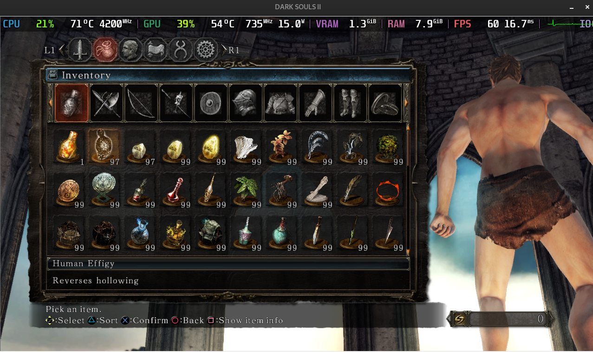

# Dark Souls II - Auto Item Drop

This is a simple script that will automatically drop items from your inventory in Dark Souls II: Scholar of the First Sin. . This is useful for quickly dropping items for trading with other players.

This was made for linux and not tested on windows.

## Dependencies

- python3
- xdotool

### Arch Linux

```bash
sudo pacman -S xdotool
```

## Usage

Open the inventory and select the first item you want to drop.

Example:



Run the script:

```bash
python main.py
```

Go back to the game.

The script will start dropping items from your inventory.

To stop the script, simply move your mouse.

## License

This project is licensed under the MIT License - see the [LICENSE](LICENSE) file for details.
